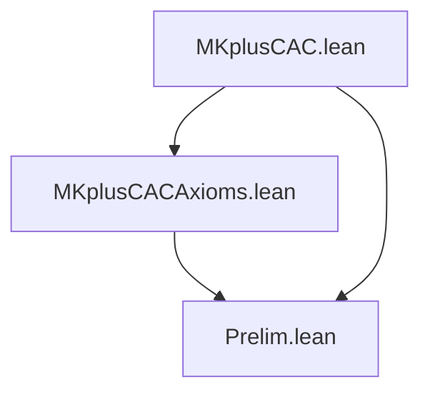

# Dependency Diagram — MKplusCAC

**Last updated:** 2026-04-04 00:00
**Author**: Julián Calderón Almendros

## Project Structure

```text
MKplusCAC/
├── Prelim.lean              # Preliminary definitions
├── _template.lean           # Module template (not imported)
├── MKplusCACAxioms.lean     # Core axioms
└── MKplusCAC.lean           # Root module
```

## Dependency Graph



## Namespace Hierarchy

### 1. **MKplusCAC** (root)
```lean
-- MKplusCAC.lean imports all modules
```

### 2. **MKplusCAC.Prelim**
```lean
namespace MKplusCAC.Prelim
  -- Preliminary definitions (ExistsUnique, etc.)
```

### 3. **MKplusCAC.MKplusCACAxioms**
```lean
namespace MKplusCAC.MKplusCACAxioms
  -- Morse-Kelley Axioms + CAC
```

## Dependencies by Level

### Level 0: Foundations
- `Prelim.lean` — no dependencies

### Level 1: Core Axioms
- `MKplusCACAxioms.lean` — depends on `Prelim.lean`

### Level N: Root
- `MKplusCAC.lean` — imports all modules

## Exports by Module

### Prelim.lean
```lean
export MKplusCAC.Prelim (
  ExistsUnique
  choose_unique
  choose_spec_unique
  choose_uniq
)
```

### MKplusCACAxioms.lean
```lean
export MKplusCAC.MKplusCACAxioms (
  -- Core definitions: IsSet, SubClass, IsClassFun, etc.
  -- Axioms: MK_Ext, MK_Pair, MK_Union, MK_CAC, etc.
)
```

## Design Notes

1. **Separation of concerns**: Each module handles one aspect.
2. **Minimal dependencies**: Only import what is strictly needed.
3. **Selective exports**: Only public definitions and theorems are exported.
4. **No Mathlib**: The project is entirely standalone (unless explicitly required in `lakefile.lean`).
5. **One namespace per module**: Mirrors file path (see `DECISIONS.md`).

## Verification Commands

```bash
make build          # Build full project
make sorry          # Check for sorry
make status         # Show locked files and sorry status
```
