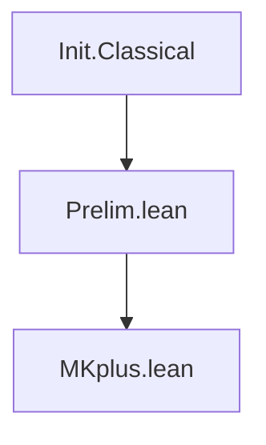

# Technical Reference — MKplus

**Last updated:** 2026-03-09 00:00
**Author**: Julián Calderón Almendros
**Lean version**: v4.28.0

---

## 1. Module Overview

### 1.1 Module Table

| Module | Namespace | Dependencies | Status |
|--------|-----------|--------------|--------|
| `Prelim.lean` | top-level | `Init.Classical` | ✅ Completo |

*Status codes*: ✅ Completo · 🔶 Parcial · 🔄 En progreso · ❌ Pendiente

---

## 2. Dependency Graph

### 2.1 Project Structure

```text
MKplus/
├── Prelim.lean         # Preliminary definitions
└── _template.lean      # Module template (not imported)
MKplus.lean             # Root module (imports only, no definitions)
```

### 2.2 Graph



*(Update this diagram as modules are added)*

### 2.3 Dependencies by Level

| Level | Module        | Depends on       |
|-------|---------------|------------------|
| 0     | `Prelim.lean` | `Init.Classical` |
| Root  | `MKplus.lean` | `Prelim.lean`    |

### 2.4 Design Notes

- **Separation of concerns**: each module handles one mathematical topic.
- **Minimal dependencies**: only import what is strictly needed.
- **Selective exports**: only public definitions and theorems are exported.
- **No Mathlib** unless explicitly required — add to `lakefile.lean`.

---

## 3. Module Descriptions

### 3.1 Prelim.lean

**Namespace**: top-level (no namespace wrapper)
**Dependencies**: `Init.Classical`
**Last updated**: 2026-03-09 00:00
**Status**: ✅ Completo

Foundational infrastructure used by all modules: custom `ExistsUnique` with full API,
both `∃!` and `∃¹` notations, dot-notation style and Peano-compatible aliases.

#### ExistsUnique

**Mathematical statement**: p has a unique witness iff ∃ x, p x ∧ ∀ y, p y → y = x

**Lean 4 signature**:
```lean
def ExistsUnique {α : Sort u} (p : α → Prop) : Prop :=
  ∃ x, p x ∧ ∀ y, p y → y = x
```

**Computability**: noncomputable (witness extraction uses `Classical.choose`)
**Dependencies**: `Init.Classical`

**Full API**:

| Name (dot-notation) | Peano alias | Description |
|---------------------|-------------|-------------|
| `ExistsUnique.intro w hw h` | — | constructor |
| `ExistsUnique.exists h` | `ExistsUnique.exists h` | extracts `∃ x, p x` |
| `ExistsUnique.choose h` | `choose_unique h` | noncomputable witness |
| `ExistsUnique.choose_spec h` | `choose_spec_unique h` | witness satisfies p |
| `ExistsUnique.unique h y hy` | `choose_uniq h hy` | uniqueness: `y = witness` |

**Lean 4 signatures**:
```lean
theorem ExistsUnique.intro {α : Sort u} {p : α → Prop} (w : α)
    (hw : p w) (h : ∀ y, p y → y = w) : ExistsUnique p

theorem ExistsUnique.exists {α : Sort u} {p : α → Prop}
    (h : ExistsUnique p) : ∃ x, p x

noncomputable def ExistsUnique.choose {α : Sort u} {p : α → Prop}
    (h : ExistsUnique p) : α

theorem ExistsUnique.choose_spec {α : Sort u} {p : α → Prop}
    (h : ExistsUnique p) : p (h.choose)

theorem ExistsUnique.unique {α : Sort u} {p : α → Prop}
    (h : ExistsUnique p) : ∀ y, p y → y = h.choose

-- Peano-compatible aliases:
noncomputable def choose_unique {α : Sort u} {p : α → Prop}
    (h : ExistsUnique p) : α

theorem choose_spec_unique {α : Sort u} {p : α → Prop}
    (h : ExistsUnique p) : p (choose_unique h)

theorem choose_uniq {α : Sort u} {p : α → Prop}
    (h : ExistsUnique p) {y : α} (hy : p y) : y = choose_unique h
```

---

## 4. Theorems

### 4.1 Prelim.lean

*(See ExistsUnique API table in §3.1 — all theorems listed there)*

---

## 5. Notations

| Symbol | Expands to | Module | Variants |
|--------|-----------|--------|---------|
| `∃! x, p` | `ExistsUnique (fun x => p)` | `Prelim.lean` | untyped only |
| `∃¹ x, p` | `ExistsUnique (fun x => p)` | `Prelim.lean` | `∃¹ x`, `∃¹ (x)`, `∃¹ (x : T)`, `∃¹ x : T` |

**Note**: `∃!` overrides Lean's built-in notation. Use `∃¹` to avoid any macro conflicts.

---

## 6. Exports

### 6.1 Prelim.lean

All names are top-level (no namespace), accessible wherever `Prelim.lean` is imported:

```lean
-- Definitions
ExistsUnique                -- Prop-valued predicate

-- Notation
∃! x, p                    -- unique existence (overrides built-in)
∃¹ x, p                    -- unique existence (safe, 4 variants)

-- Dot-notation API
ExistsUnique.intro
ExistsUnique.exists
ExistsUnique.choose         -- noncomputable
ExistsUnique.choose_spec
ExistsUnique.unique

-- Peano-compatible aliases
choose_unique               -- noncomputable
choose_spec_unique
choose_uniq
```

---

## 7. Documentation Status

### 7.1 Fully Projected Files

- `Prelim.lean` — ExistsUnique complete (1 def + 5 theorems/defs + 3 aliases + 2 notations)

### 7.2 Partially Projected Files

*(None)*

### 7.3 Notes

*(None)*
