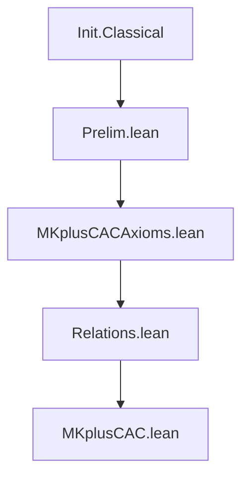

# Technical Reference — MKplusCAC

**Last updated:** 2026-04-04 00:00
**Author**: Julián Calderón Almendros
**Lean version**: v4.28.0

---

## 1. Module Overview

### 1.1 Module Table

| Module | Namespace | Dependencies | Status |
|--------|-----------|--------------|--------|
| `Prelim.lean` | top-level | `Init.Classical` | ✅ Completo |
| `MKplusCACAxioms.lean` | `MKplusCAC` | `Prelim.lean` | ✅ Completo |
| `Relations.lean` | `MKplusCAC` | `MKplusCACAxioms.lean` | ✅ Completo |

*Status codes*: ✅ Completo · 🔶 Parcial · 🔄 En progreso · ❌ Pendiente

---

## 2. Dependency Graph

### 2.1 Project Structure

```text
MKplusCAC/
├── Prelim.lean            # Preliminary definitions
├── MKplusCACAxioms.lean   # Core axioms for MK+CAC
├── Relations.lean         # Relations, prod, inv, comp
└── _template.lean         # Module template (not imported)
MKplusCAC.lean             # Root module (imports only, no definitions)
```

### 2.2 Graph



*(Update this diagram as modules are added)*

### 2.3 Dependencies by Level

| Level | Module | Depends on |
|-------|--------|------------|
| 0 | `Prelim.lean` | `Init.Classical` |
| 1 | `MKplusCACAxioms.lean`| `Prelim.lean` |
| 2 | `Relations.lean` | `MKplusCACAxioms.lean` |
| Root | `MKplusCAC.lean` | `Relations.lean` |

### 2.4 Design Notes

- **Separation of concerns**: each module handles one mathematical topic.
- **Minimal dependencies**: only import what is strictly needed.
- **Selective exports**: only public definitions and theorems are exported.
- **No Mathlib** unless explicitly required — add to `lakefile.lean`.

---

## 3. Module Descriptions

### 3.1 Prelim.lean

**Namespace**: top-level (no namespace wrapper)
**Dependencies**: `Init.Classical`
**Last updated**: 2026-03-09 00:00
**Status**: ✅ Completo

Foundational infrastructure used by all modules: custom `ExistsUnique` with full API.

### 3.2 MKplusCACAxioms.lean

**Namespace**: `MKplusCAC`
**Dependencies**: `Prelim.lean`
**Status**: ✅ Completo

Core axioms of Morse-Kelley set theory plus the Class Axiom Scheme of Choice.
Defines foundational notions such as `Mem`, `IsSet`, `SubClass`, `opair`, `classComp`, etc.

### 3.3 Relations.lean

**Namespace**: `MKplusCAC`
**Dependencies**: `MKplusCACAxioms.lean`
**Last updated**: 2026-04-04 00:00
**Status**: ✅ Completo

Defines operations for classes interpreted as relations (Cartesian product, range, inverse, composition) and fundamental properties (reflexive, symmetric, transitive, etc.).

---

## 4. Theorems

### 4.1 Relations.lean

| Name | Description |
|------|-------------|
| `mem_prod_iff` | Characterizes membership in `A ×ᴹ B`. |
| `mem_rng_iff` | Characterizes membership in `rng R`. |
| `mem_inv_iff` | Characterizes membership in `R⁻¹`. |
| `mem_comp_iff` | Characterizes membership in `S ∘ᴹ R`. |
| `inv_inv` | Proves that `(R⁻¹)⁻¹ = R ∩ᴹ (𝐕ᴹ ×ᴹ 𝐕ᴹ)`. |
| `inv_comp` | Proves that `(S ∘ᴹ R)⁻¹ = R⁻¹ ∘ᴹ S⁻¹`. |
| `comp_assoc` | Proves associativity of composition `(T ∘ᴹ S) ∘ᴹ R = T ∘ᴹ (S ∘ᴹ R)`. |

---

## 5. Notations

| Symbol | Expands to | Module |
|--------|-----------|--------|
| `∃! x, p` | `ExistsUnique (fun x => p)` | `Prelim.lean` |
| `∃¹ x, p` | `ExistsUnique (fun x => p)` | `Prelim.lean` |
| `∈ᴹ` | `Mem` | `MKplusCACAxioms.lean` |
| `⊆ᴹ` | `SubClass` | `MKplusCACAxioms.lean` |
| `∪ᴹ` | `union` | `MKplusCACAxioms.lean` |
| `∩ᴹ` | `inter` | `MKplusCACAxioms.lean` |
| `∖ᴹ` | `sdiff` | `MKplusCACAxioms.lean` |
| `△ᴹ` | `symmDiff` | `MKplusCACAxioms.lean` |
| `×ᴹ` | `prod` | `Relations.lean` |
| `⁻¹` | `inv` | `Relations.lean` |
| `∘ᴹ` | `comp` | `Relations.lean` |

---

## 6. Exports

### 6.1 Relations.lean

```lean
-- Definitions
prod
rng
inv
comp
IsRel
ReflexiveOn
Symmetric
Transitive
EquivalenceOn
Antisymmetric
PartialOrderOn
TotalOrderOn

-- Theorems
mem_prod_iff
mem_rng_iff
mem_inv_iff
mem_comp_iff
inv_inv
inv_comp
comp_assoc
```

---

## 7. Documentation Status

### 7.1 Fully Projected Files

- `Prelim.lean`
- `MKplusCACAxioms.lean`
- `Relations.lean`

### 7.2 Partially Projected Files

*(None)*

### 7.3 Notes

*(None)*
